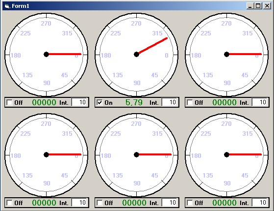



## ocx odometer

### Description

create a visual odometer ocx using simple controls such lines and shapes. Could be improved to suit your needs.
 
### More Info
 

             |
---                |---
**Submitted On**   |2002-08-16 16:13:36
**By**             |[sebastian wolter](https://github.com/Planet-Source-Code/PSCIndex/blob/master/ByAuthor/sebastian-wolter.md)
**Level**          |Beginner
**User Rating**    |5.0 (10 globes from 2 users)
**Compatibility**  |VB 6\.0
**Category**       |[OLE/ COM/ DCOM/ Active\-X](https://github.com/Planet-Source-Code/PSCIndex/blob/master/ByCategory/ole-com-dcom-active-x__1-29.md)
**World**          |[Visual Basic](https://github.com/Planet-Source-Code/PSCIndex/blob/master/ByWorld/visual-basic.md)
**Archive File**   |[ocx\_odomet1190358162002\.zip](https://github.com/Planet-Source-Code/sebastian-wolter-ocx-odometer__1-38019/archive/master.zip)

